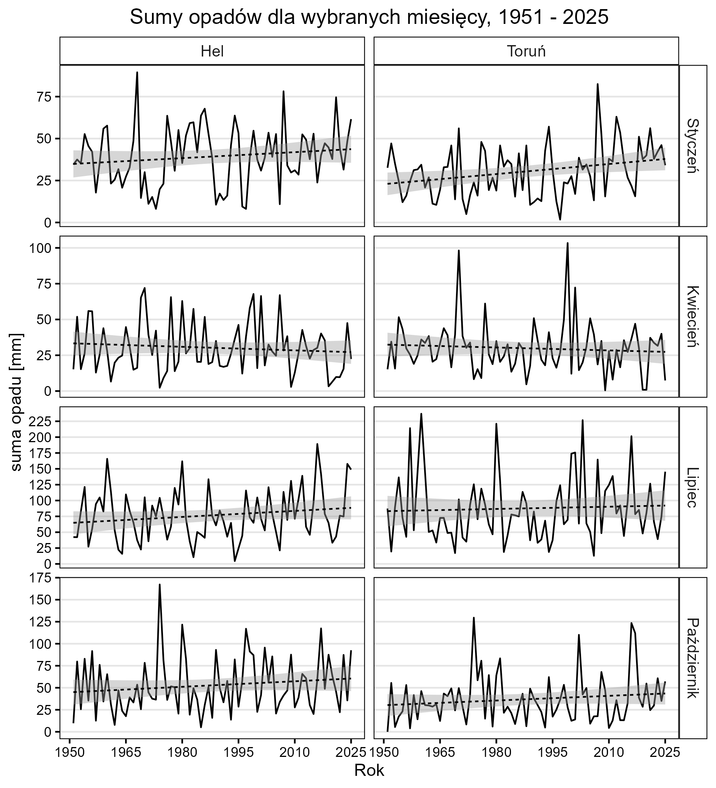
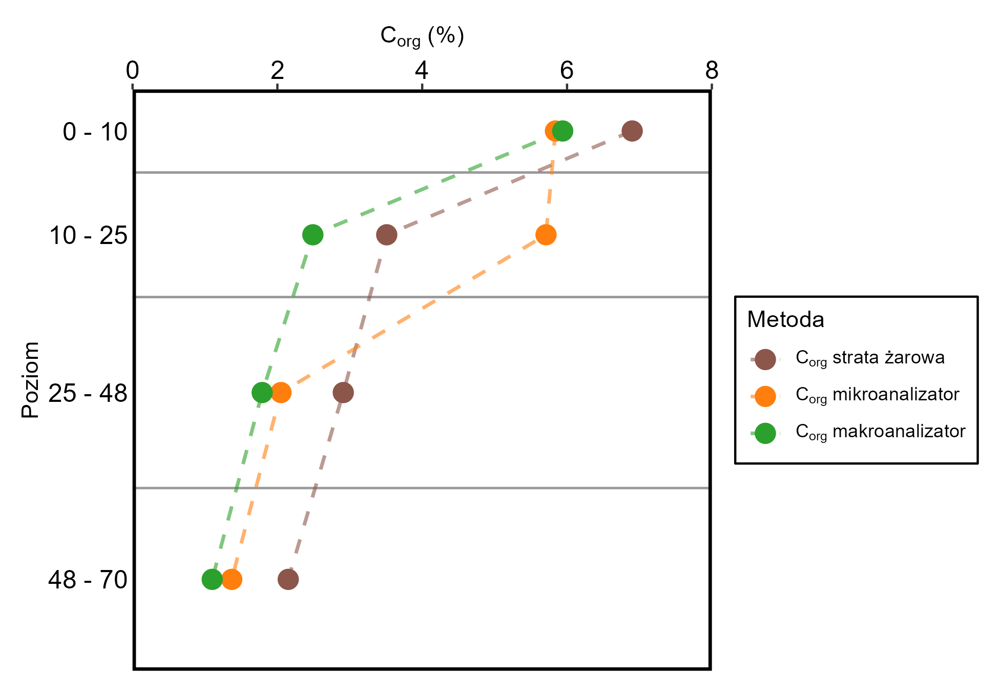
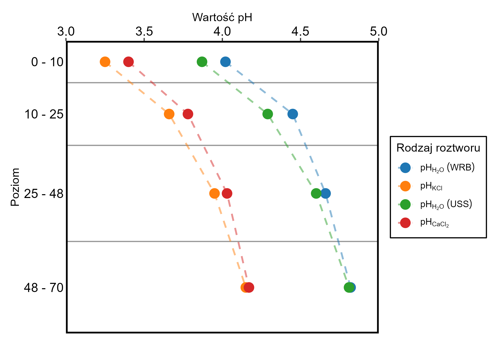
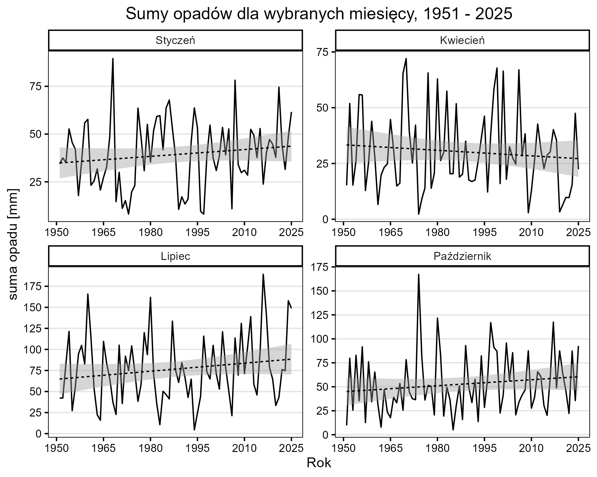

# Charts-and-vis-works

---

## Analysis of rainfall patterns 

---

## Charts representing soil composition depth profiles

---

## Map, adhering strictly to principles of cartographic visualisation

---

## An example presentation i made

[:page_facing_up:Practice Presentation (PDF)](Practice_Presentation.pdf)

---

